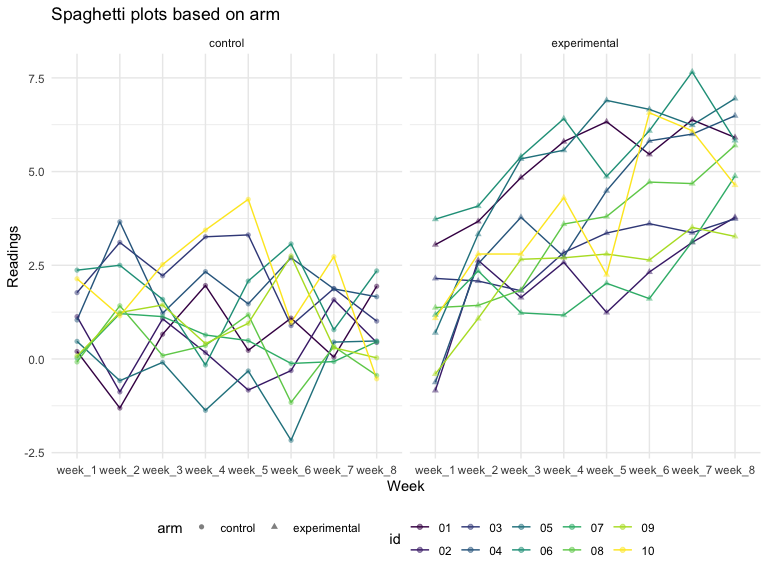

p8105\_hw5\_qy2234
================
Michael Yan
11/5/2019

# General setup

# Problem 1

``` r
## load in the given dataset and clean the names
set.seed(10)

iris_with_missing = iris %>% 
  map_df(~replace(.x, sample(1:150, 20), NA)) %>%
  mutate(Species = as.character(Species)) %>% 
  janitor::clean_names()
```

``` r
fill_missing = function(x) {
  if (is.numeric(x)) {
     x = replace_na(x, round(mean(x, na.rm = TRUE),1))
  }
  else if (is.character(x)) {
     x = replace_na(x, "virginica")
  }
  x
}
map(iris_with_missing, fill_missing) %>% 
  bind_cols()
```

    ## # A tibble: 150 x 5
    ##    sepal_length sepal_width petal_length petal_width species
    ##           <dbl>       <dbl>        <dbl>       <dbl> <chr>  
    ##  1          5.1         3.5          1.4         0.2 setosa 
    ##  2          4.9         3            1.4         0.2 setosa 
    ##  3          4.7         3.2          1.3         0.2 setosa 
    ##  4          4.6         3.1          1.5         1.2 setosa 
    ##  5          5           3.6          1.4         0.2 setosa 
    ##  6          5.4         3.9          1.7         0.4 setosa 
    ##  7          5.8         3.4          1.4         0.3 setosa 
    ##  8          5           3.4          1.5         0.2 setosa 
    ##  9          4.4         2.9          1.4         0.2 setosa 
    ## 10          4.9         3.1          3.8         0.1 setosa 
    ## # … with 140 more rows

# Problem 2

``` r
## import data, create a read file function, combine files
file_names = list.files("./data")

read_file = function(x) {
  path = str_c("./data/",x)
  read_csv(path)
}

combined_df = 
  purrr::map(file_names,read_file) %>%
  bind_rows() %>% 
  janitor::clean_names() %>%
  mutate(file_names = file_names) %>% 
  separate(file_names, into = c("arm", "id"), sep = "_") %>% 
  mutate(arm = recode(arm, 
                            "con" = "control", 
                            "exp" = "experimental")) %>%
  mutate(id = str_remove(id,".csv")) %>% 
  select(id, arm, everything())
```

    ## Parsed with column specification:
    ## cols(
    ##   week_1 = col_double(),
    ##   week_2 = col_double(),
    ##   week_3 = col_double(),
    ##   week_4 = col_double(),
    ##   week_5 = col_double(),
    ##   week_6 = col_double(),
    ##   week_7 = col_double(),
    ##   week_8 = col_double()
    ## )
    ## Parsed with column specification:
    ## cols(
    ##   week_1 = col_double(),
    ##   week_2 = col_double(),
    ##   week_3 = col_double(),
    ##   week_4 = col_double(),
    ##   week_5 = col_double(),
    ##   week_6 = col_double(),
    ##   week_7 = col_double(),
    ##   week_8 = col_double()
    ## )
    ## Parsed with column specification:
    ## cols(
    ##   week_1 = col_double(),
    ##   week_2 = col_double(),
    ##   week_3 = col_double(),
    ##   week_4 = col_double(),
    ##   week_5 = col_double(),
    ##   week_6 = col_double(),
    ##   week_7 = col_double(),
    ##   week_8 = col_double()
    ## )
    ## Parsed with column specification:
    ## cols(
    ##   week_1 = col_double(),
    ##   week_2 = col_double(),
    ##   week_3 = col_double(),
    ##   week_4 = col_double(),
    ##   week_5 = col_double(),
    ##   week_6 = col_double(),
    ##   week_7 = col_double(),
    ##   week_8 = col_double()
    ## )
    ## Parsed with column specification:
    ## cols(
    ##   week_1 = col_double(),
    ##   week_2 = col_double(),
    ##   week_3 = col_double(),
    ##   week_4 = col_double(),
    ##   week_5 = col_double(),
    ##   week_6 = col_double(),
    ##   week_7 = col_double(),
    ##   week_8 = col_double()
    ## )
    ## Parsed with column specification:
    ## cols(
    ##   week_1 = col_double(),
    ##   week_2 = col_double(),
    ##   week_3 = col_double(),
    ##   week_4 = col_double(),
    ##   week_5 = col_double(),
    ##   week_6 = col_double(),
    ##   week_7 = col_double(),
    ##   week_8 = col_double()
    ## )
    ## Parsed with column specification:
    ## cols(
    ##   week_1 = col_double(),
    ##   week_2 = col_double(),
    ##   week_3 = col_double(),
    ##   week_4 = col_double(),
    ##   week_5 = col_double(),
    ##   week_6 = col_double(),
    ##   week_7 = col_double(),
    ##   week_8 = col_double()
    ## )
    ## Parsed with column specification:
    ## cols(
    ##   week_1 = col_double(),
    ##   week_2 = col_double(),
    ##   week_3 = col_double(),
    ##   week_4 = col_double(),
    ##   week_5 = col_double(),
    ##   week_6 = col_double(),
    ##   week_7 = col_double(),
    ##   week_8 = col_double()
    ## )
    ## Parsed with column specification:
    ## cols(
    ##   week_1 = col_double(),
    ##   week_2 = col_double(),
    ##   week_3 = col_double(),
    ##   week_4 = col_double(),
    ##   week_5 = col_double(),
    ##   week_6 = col_double(),
    ##   week_7 = col_double(),
    ##   week_8 = col_double()
    ## )
    ## Parsed with column specification:
    ## cols(
    ##   week_1 = col_double(),
    ##   week_2 = col_double(),
    ##   week_3 = col_double(),
    ##   week_4 = col_double(),
    ##   week_5 = col_double(),
    ##   week_6 = col_double(),
    ##   week_7 = col_double(),
    ##   week_8 = col_double()
    ## )
    ## Parsed with column specification:
    ## cols(
    ##   week_1 = col_double(),
    ##   week_2 = col_double(),
    ##   week_3 = col_double(),
    ##   week_4 = col_double(),
    ##   week_5 = col_double(),
    ##   week_6 = col_double(),
    ##   week_7 = col_double(),
    ##   week_8 = col_double()
    ## )
    ## Parsed with column specification:
    ## cols(
    ##   week_1 = col_double(),
    ##   week_2 = col_double(),
    ##   week_3 = col_double(),
    ##   week_4 = col_double(),
    ##   week_5 = col_double(),
    ##   week_6 = col_double(),
    ##   week_7 = col_double(),
    ##   week_8 = col_double()
    ## )
    ## Parsed with column specification:
    ## cols(
    ##   week_1 = col_double(),
    ##   week_2 = col_double(),
    ##   week_3 = col_double(),
    ##   week_4 = col_double(),
    ##   week_5 = col_double(),
    ##   week_6 = col_double(),
    ##   week_7 = col_double(),
    ##   week_8 = col_double()
    ## )
    ## Parsed with column specification:
    ## cols(
    ##   week_1 = col_double(),
    ##   week_2 = col_double(),
    ##   week_3 = col_double(),
    ##   week_4 = col_double(),
    ##   week_5 = col_double(),
    ##   week_6 = col_double(),
    ##   week_7 = col_double(),
    ##   week_8 = col_double()
    ## )
    ## Parsed with column specification:
    ## cols(
    ##   week_1 = col_double(),
    ##   week_2 = col_double(),
    ##   week_3 = col_double(),
    ##   week_4 = col_double(),
    ##   week_5 = col_double(),
    ##   week_6 = col_double(),
    ##   week_7 = col_double(),
    ##   week_8 = col_double()
    ## )
    ## Parsed with column specification:
    ## cols(
    ##   week_1 = col_double(),
    ##   week_2 = col_double(),
    ##   week_3 = col_double(),
    ##   week_4 = col_double(),
    ##   week_5 = col_double(),
    ##   week_6 = col_double(),
    ##   week_7 = col_double(),
    ##   week_8 = col_double()
    ## )
    ## Parsed with column specification:
    ## cols(
    ##   week_1 = col_double(),
    ##   week_2 = col_double(),
    ##   week_3 = col_double(),
    ##   week_4 = col_double(),
    ##   week_5 = col_double(),
    ##   week_6 = col_double(),
    ##   week_7 = col_double(),
    ##   week_8 = col_double()
    ## )
    ## Parsed with column specification:
    ## cols(
    ##   week_1 = col_double(),
    ##   week_2 = col_double(),
    ##   week_3 = col_double(),
    ##   week_4 = col_double(),
    ##   week_5 = col_double(),
    ##   week_6 = col_double(),
    ##   week_7 = col_double(),
    ##   week_8 = col_double()
    ## )
    ## Parsed with column specification:
    ## cols(
    ##   week_1 = col_double(),
    ##   week_2 = col_double(),
    ##   week_3 = col_double(),
    ##   week_4 = col_double(),
    ##   week_5 = col_double(),
    ##   week_6 = col_double(),
    ##   week_7 = col_double(),
    ##   week_8 = col_double()
    ## )
    ## Parsed with column specification:
    ## cols(
    ##   week_1 = col_double(),
    ##   week_2 = col_double(),
    ##   week_3 = col_double(),
    ##   week_4 = col_double(),
    ##   week_5 = col_double(),
    ##   week_6 = col_double(),
    ##   week_7 = col_double(),
    ##   week_8 = col_double()
    ## )

``` r
combined_df %>%
  knitr::kable()
```

| id | arm          | week\_1 | week\_2 | week\_3 | week\_4 | week\_5 | week\_6 | week\_7 | week\_8 |
| :- | :----------- | ------: | ------: | ------: | ------: | ------: | ------: | ------: | ------: |
| 01 | control      |    0.20 |  \-1.31 |    0.66 |    1.96 |    0.23 |    1.09 |    0.05 |    1.94 |
| 02 | control      |    1.13 |  \-0.88 |    1.07 |    0.17 |  \-0.83 |  \-0.31 |    1.58 |    0.44 |
| 03 | control      |    1.77 |    3.11 |    2.22 |    3.26 |    3.31 |    0.89 |    1.88 |    1.01 |
| 04 | control      |    1.04 |    3.66 |    1.22 |    2.33 |    1.47 |    2.70 |    1.87 |    1.66 |
| 05 | control      |    0.47 |  \-0.58 |  \-0.09 |  \-1.37 |  \-0.32 |  \-2.17 |    0.45 |    0.48 |
| 06 | control      |    2.37 |    2.50 |    1.59 |  \-0.16 |    2.08 |    3.07 |    0.78 |    2.35 |
| 07 | control      |    0.03 |    1.21 |    1.13 |    0.64 |    0.49 |  \-0.12 |  \-0.07 |    0.46 |
| 08 | control      |  \-0.08 |    1.42 |    0.09 |    0.36 |    1.18 |  \-1.16 |    0.33 |  \-0.44 |
| 09 | control      |    0.08 |    1.24 |    1.44 |    0.41 |    0.95 |    2.75 |    0.30 |    0.03 |
| 10 | control      |    2.14 |    1.15 |    2.52 |    3.44 |    4.26 |    0.97 |    2.73 |  \-0.53 |
| 01 | experimental |    3.05 |    3.67 |    4.84 |    5.80 |    6.33 |    5.46 |    6.38 |    5.91 |
| 02 | experimental |  \-0.84 |    2.63 |    1.64 |    2.58 |    1.24 |    2.32 |    3.11 |    3.78 |
| 03 | experimental |    2.15 |    2.08 |    1.82 |    2.84 |    3.36 |    3.61 |    3.37 |    3.74 |
| 04 | experimental |  \-0.62 |    2.54 |    3.78 |    2.73 |    4.49 |    5.82 |    6.00 |    6.49 |
| 05 | experimental |    0.70 |    3.33 |    5.34 |    5.57 |    6.90 |    6.66 |    6.24 |    6.95 |
| 06 | experimental |    3.73 |    4.08 |    5.40 |    6.41 |    4.87 |    6.09 |    7.66 |    5.83 |
| 07 | experimental |    1.18 |    2.35 |    1.23 |    1.17 |    2.02 |    1.61 |    3.13 |    4.88 |
| 08 | experimental |    1.37 |    1.43 |    1.84 |    3.60 |    3.80 |    4.72 |    4.68 |    5.70 |
| 09 | experimental |  \-0.40 |    1.08 |    2.66 |    2.70 |    2.80 |    2.64 |    3.51 |    3.27 |
| 10 | experimental |    1.09 |    2.80 |    2.80 |    4.30 |    2.25 |    6.57 |    6.09 |    4.64 |

``` r
# make a spaghetti plot showing observations on each subject over time
combined_df %>% 
  pivot_longer(week_1:week_8,
               names_to = "week",
               values_to = "readings") %>% 
  ggplot(aes(x = week, y = readings, color = id, group = id)) +
  geom_line() +
  geom_point(aes(shape = arm), alpha = .5) +
  facet_grid(.~arm) +
  labs(title = "Spaghetti plots based on arm",
       x = "Week",
       y = "Readings")
```



  - Based on the spaghetti plots made, we can see that there is not
    really an increase or a decrease for the control group. The
    observations for individuals fluctuate a lot but basiclly stay the
    same across the period of the experiment. There is not a significant
    enough trend. On the other hand, for the experimental group,
    although individual data still fluatuates a lot, there is a obvious
    increasing trend as the experiment proceed. In general, we see a
    higher average reading for the individuals in the experimental group
    compared to the ones from the control group.
